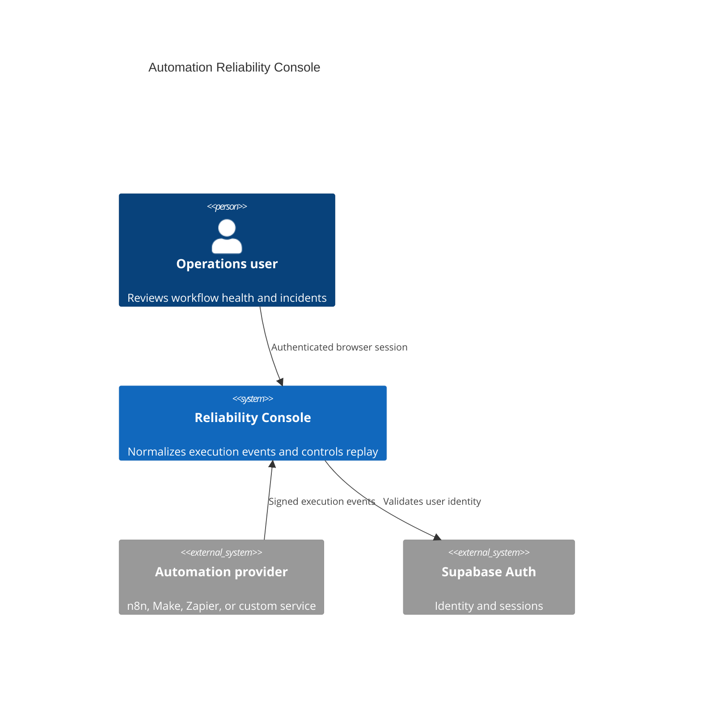
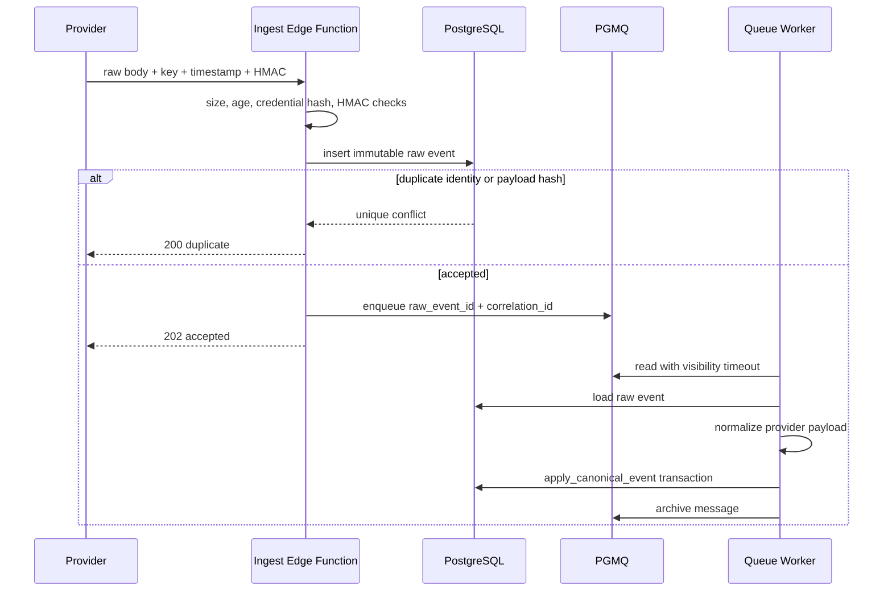
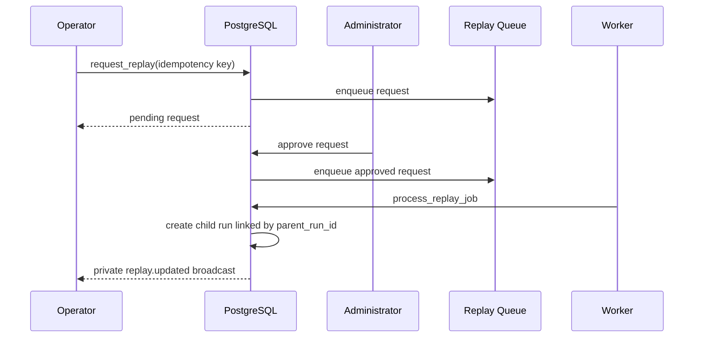
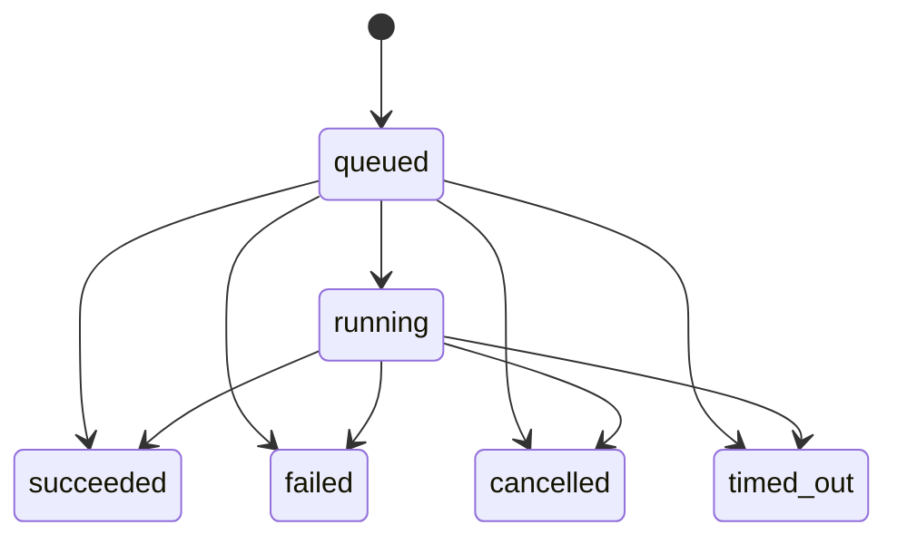
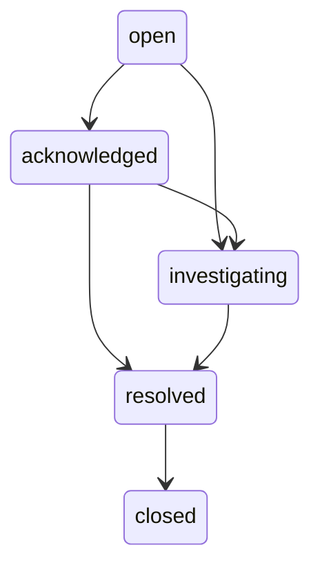
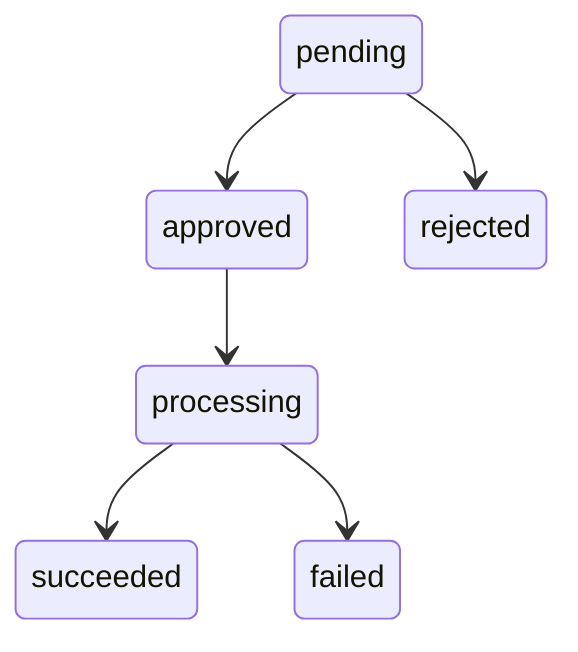

# Architecture

## System Context

## Component Responsibilities

| Component       | Responsibility                                                  | Trust boundary              |
| --------------- | --------------------------------------------------------------- | --------------------------- |
| React web       | Tenant-scoped operational workflows                             | Publishable key only        |
| Edge Functions  | Public webhook and authenticated platform commands              | Service key server-side     |
| PostgreSQL      | Authorization, invariants, state transitions, audit history     | Authoritative               |
| PGMQ + Cron     | Durable retries and scheduled health checks                     | Service-only RPCs           |
| Realtime        | Small private invalidation messages                             | Organization topic policy   |
| Private Storage | Execution artifacts                                             | Record-backed signed access |
| FastAPI         | Reusable normalization, redaction, analytics, replay simulation | Internal token              |

## Event Ingestion

The raw body is used for signature verification before JSON parsing.
`original_payload` and `payload_hash` are immutable. Normalization warnings are
stored on the workflow metadata without rejecting unknown additional fields.

## Event Ordering

The tuple `(integration_source_id, external_run_id)` identifies a canonical run.
An event may keep the current state or make a legal forward transition. An older
event cannot overwrite a newer terminal state; it is marked processed with
`out_of_order_ignored`. An illegal transition is recorded as a processing
failure. Repeated failures become dead-letter records after five reads.

## Replay

The reference replay is deterministic and synthetic. It proves authorization,
idempotency, lineage, background processing, and audit behavior without invoking
an external customer system.

## State Machines

## Raw Versus Canonical Data

Raw events answer “what exactly did the provider send?” Canonical runs answer
“what is the current operational truth?” Keeping both allows adapter changes,
reprocessing, schema-version handling, forensic review, and stable frontend
queries without mutating source evidence.

## Failure Strategy

- Webhook failures return structured errors without payload logging.
- Queue reads use a 60-second visibility timeout.
- Consumers archive only after successful processing.
- Five unsuccessful reads move a safe message summary to a dead-letter queue.
- Idempotency is enforced at raw event, run, replay request, and replay run levels.
- Correlation IDs connect ingress, queue, state change, and audit evidence.
