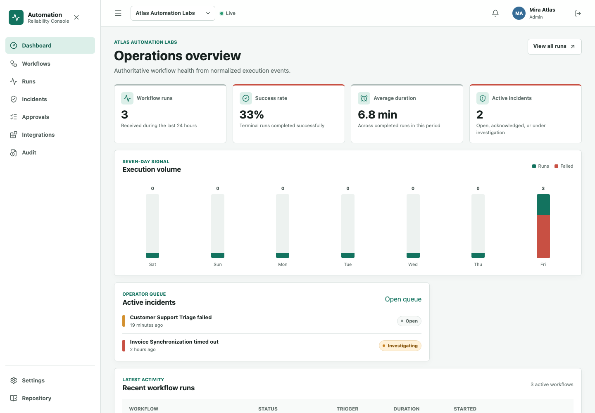
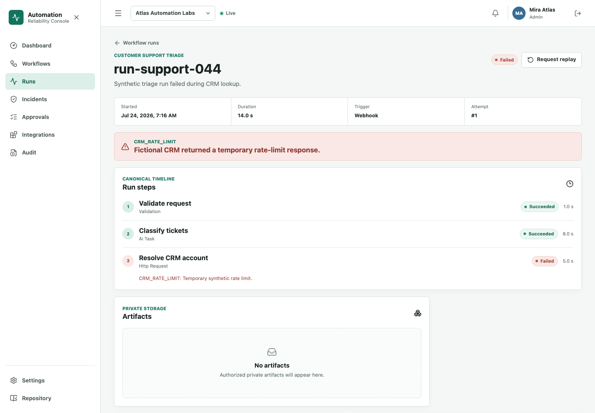
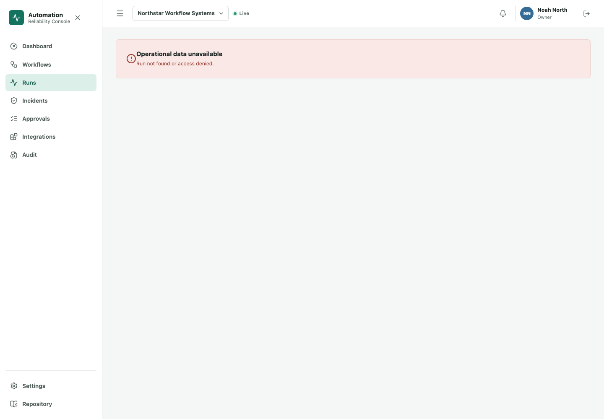
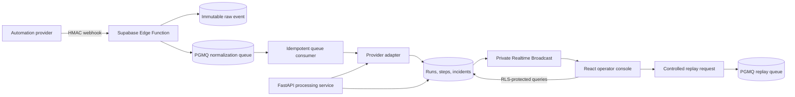

# Automation Reliability Console

**A multi-tenant operations console for receiving, normalizing, monitoring, and safely replaying automation executions.**

[](https://github.com/Kartikm09/automation-reliability-console/actions/workflows/ci.yml)
[](LICENSE)
[](services/api)
[](apps/web)

> This is an independently designed technical reference implementation. All
> organizations, users, payloads, and incidents are fictional. It is not client
> work and does not claim prior production usage.

## Why It Exists

Automation providers emit different payloads, retry events, deliver updates out
of order, and occasionally fail mid-run. Copying those payloads directly into a
dashboard makes the product model unstable and makes operational review harder.

This project preserves each signed event exactly as received, then applies a
provider adapter to a canonical run model. Durable queues separate acceptance
from processing. PostgreSQL state machines, RLS, private Storage, audit records,
and private Realtime channels keep the operator workflow controlled.

## Verified Status

The dedicated Supabase backend, seven Edge Functions, private Storage,
organization Broadcast channels, three durable queues, and encrypted
Cron-triggered worker are deployed and verified. Local and hosted database
suites each pass 86 pgTAP assertions. The
[React operator console](https://automation-reliability-console.zw386.chatgpt.site)
is publicly deployed and its authenticated desktop and mobile workflows pass
against the production URL. FastAPI is container-verified locally because no
authenticated public container provider is available in this environment.

## Capabilities

| Area            | Demonstrated behavior                                                   |
| --------------- | ----------------------------------------------------------------------- |
| Tenant security | PostgreSQL-enforced owner, admin, operator, and viewer access           |
| Event intake    | HMAC signature, one-time credentials, replay window, request limit      |
| Normalization   | Custom, n8n-like, Make-like, and Zapier-like synthetic adapters         |
| Reliability     | Idempotency, event ordering, retries, visibility timeouts, dead letters |
| Operations      | Run timelines, incidents, approvals, replay lineage, audit evidence     |
| Data handling   | Immutable raw payload, redacted summaries, private signed artifacts     |
| Live UI         | Private organization Broadcast channels with authoritative refetch      |
| Verification    | pgTAP, Deno, Pytest, Vitest, Playwright, secret scan, Docker builds     |

## Product Tour



The run view keeps provider-neutral state, timing, step evidence, and replay
controls together without exposing unrestricted source payloads.



Tenant isolation is visible as well as testable: a Northstar user receives no
Atlas run record when attempting the same direct URL.



## Architecture



Edge Functions handle low-latency platform boundaries and authorization.
FastAPI owns reusable heavier processing and can run independently in validation
mode. See [ARCHITECTURE.md](ARCHITECTURE.md) for sequences and state machines.

## Demonstration Workflow

1. An administrator creates a custom integration source.
2. A one-time webhook credential is generated and stored only as a SHA-256 hash.
3. A signed event is accepted, preserved, and queued.
4. A provider adapter creates or updates a canonical run and step timeline.
5. A failed run creates an incident and operator notification.
6. An operator acknowledges the incident and requests a replay.
7. An administrator approves the replay; the worker creates a linked synthetic run.
8. Every protected action is appended to the tenant audit history.
9. A second organization receives no rows, signed URLs, or private channel access.

## Repository Map

```text
apps/web/                 React + TypeScript operator console
services/api/             FastAPI normalization and processing service
packages/contracts/       Shared browser-side validation contracts
supabase/migrations/      Reproducible schema, RLS, queues, Cron, state machines
supabase/functions/       Webhook, credentials, replay, approval, artifact functions
supabase/tests/           pgTAP structure, RLS, and workflow tests
tests/e2e/                Authenticated browser and tenant-isolation scenarios
tests/fixtures/           Synthetic provider payloads
docs/                     Architecture, security, decisions, screenshots
scripts/                  Secret scan and environment-controlled demo setup
```

## Quick Start

Prerequisites: Docker, Node.js 24, Python 3.11+, Deno 2, and Supabase CLI 2.

```bash
cp .env.example .env
make setup
make db-start
make db-reset
make dev
```

The containerized frontend runs at `http://127.0.0.1:4173`, FastAPI at
`http://127.0.0.1:8000`, and local Supabase at `http://127.0.0.1:54321`.
Running `npm run dev` separately uses Vite at `http://127.0.0.1:5173`.
Demo passwords are never committed. Configure users with environment values:

```bash
node scripts/setup-demo-users.mjs
```

## Verification

```bash
make lint
make db-test
make edge-test
make api-test
make web-test
make build
make docker-build
```

Test counts and the exact latest commands belong in [TEST_REPORT.md](TEST_REPORT.md).
Deployment truth, including any externally blocked component, belongs in
[DEPLOYMENT_REPORT.md](DEPLOYMENT_REPORT.md).

## Security Model

- Every exposed application table has forced RLS.
- Authorization helpers use narrow `SECURITY DEFINER` functions and explicit
  `search_path` values.
- The credential-bearing integration table is not readable by browser roles;
  members query a safe filtered view.
- Raw webhook events cannot be inserted by normal users or mutated after intake.
- Audit and incident-event histories are append-only for ordinary users.
- Artifact paths are record-backed and signed only after tenant authorization.
- Service-role credentials remain in server environments and never enter the
  browser build.

Read [SECURITY.md](SECURITY.md) and
[docs/security/threat-model.md](docs/security/threat-model.md) before adapting
this project.

## Skills Demonstrated

Supabase Auth, PostgreSQL, RLS, pgTAP, private Storage, Edge Functions, Realtime
Broadcast, PGMQ, pg_cron, React, strict TypeScript, TanStack Query, Zod,
FastAPI, Pydantic, Pytest, Playwright, Docker, CI/CD, webhook security,
idempotency, state-machine design, auditability, and operational UX.

## Recruiter Walkthrough

Start with the architecture above, inspect the RLS tests in
`supabase/tests/010_rls.test.sql`, follow
`apply_canonical_event` in the second migration, then open the dashboard, a
failed run, its incident, and the audit timeline. The walkthrough takes about
ten minutes and shows the system boundary, the authorization proof, and the
operator experience.

## Honest Limitations

- Provider payloads are realistic synthetic fixtures, not official provider SDK
  integrations.
- Replay deliberately simulates a controlled result; it does not call a paid
  external automation account.
- In-app notifications are implemented; external email delivery is intentionally
  optional.
- Local Supabase containers are a development environment, not a hardened
  production sandbox.

## Portfolio Summary

Designed and implemented a multi-tenant automation operations console using
React, FastAPI, and Supabase. Built signed webhook ingestion, immutable raw-event
storage, provider normalization, durable processing, incident workflows,
controlled replay, private artifacts, RLS isolation, Realtime updates, and
multi-layer automated tests using entirely synthetic data.

## License

[Apache License 2.0](LICENSE)
